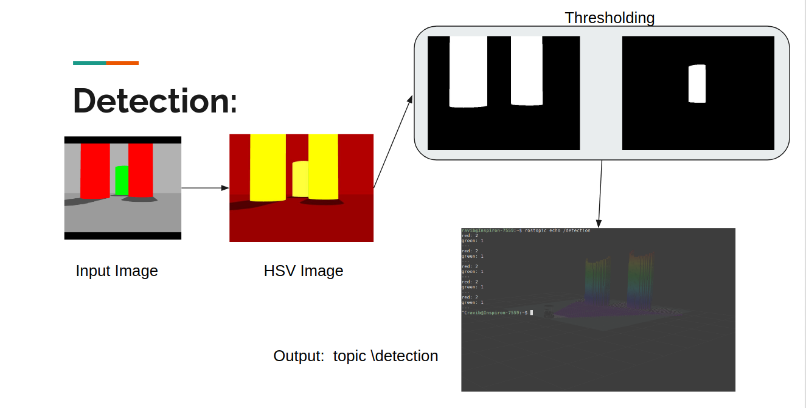
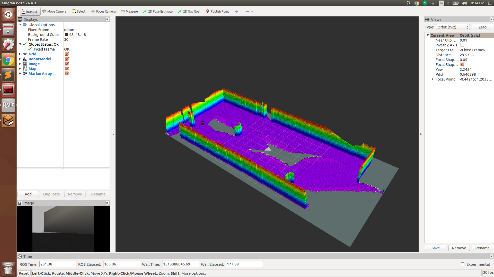

[](https://travis-ci.org/raviBhadeshiya/enigma)
[](LICENSE)
# enigma
One of the big tech topics of 2017 is automation−whether and how robots can replace or augmentwork done by humans.  In order to do the kind of work a human security guard would normally do,the robot should use cameras, sensors, navigation equipment, and electric motors−all packed intoits dome-shaped body with a big rechargeable battery and a computer. The autonomous guidancesystem allows the robot to store its cruise route and move automatically without an operator.  It is based on the input video camera and other sensors; allowing the UGV to follow the path accurately,detect and avoid the obstacles. 
The package present real time indoor security device we call Enigma! The robotics system using TurtlBot to perform a surveillance of a virtual environment generated by 3D Gazebo simulator. This system performs an indoor surveillance byperforming SLAM and video processing, in order to ensure that any possible ananomly is detected by the color of an object such as Red or Green colored cylinder.

The system will 3D-map an unknown environment. While 3D-mapping the unknown environment, the bot will perform patrol by running the detection node to find the ananomly such as red-colored cylinder object.  There is be custom world with red and green colored cylinders. The detection algorithm is very naive such as transform image to HSV space, then thresholding and region detection for the object (red colored cylinder).Then object count is publish on the "\detection" topic and user will get notified by info message. Please check below:



##### Output with 3D-mapping




## Dependency
 * [ROS Kinetic](http://wiki.ros.org/ROS/Installation) on Ubuntu 16.04
 * [Gazebo](http://gazebosim.org/)
 * [TurtleBot](http://wiki.ros.org/Robots/TurtleBot)
 * [octomap](http://wiki.ros.org/octomap)

## Standard install via command-line
```
$ mkdir -p ~/catkin_ws/src
$ cd ~/catkin_ws/
$ catkin_make
$ source devel/setup.bash
$ cd src/
$ git clone --recursive https://github.com/raviBhadeshiya/enigma.git
$ cd ..
$ catkin_make
```
>NOTE: Missing dependency can be added via following command but highly encourage to install sepratly!

```
~/catkin_ws$ rosdep install --from-paths src --ignore-src --rosdistro kinetic -y
```
However for octomap installation follow the tutorial:[link](http://wiki.ros.org/octomap)

---
## Execution
The following package can ber start with single launch file as follows:
```
$ roslaunch enigma enigma.launch
```
>Arguments: record:=true for recording rosbag file and  world:=enigma/map/final_world_1 for testing custom word file.

>Note: roslaunch will automatically start roscore if it detects that it is not already running.
##### Package Interface:
The following package use the rosservice to intract with package.
###### Start/Stop Robot Motion
To call this service, open a new terminal and type:

```
$ rosservice call /robotSwitch true
```
Argument true will cause robot to start motion and false will cause robot to stop the motion.
>Note: After roslaunch if robot is not moving, call this service to start motion.
###### Change Robot Speed
If you want to change the speed of the robot,then open a new terminal and make new service call:

```
$ rosservice call /robotSpeed 0.8
```
Argument will set the robot max speed to 0.8 but you can pass any valid speed between 0 to 1.0
###### Start/Stop Detection
To call this service, similarly open a new terminal and type:
```
$ rosservice call /detectionSwitch true
```
Argument true will cause detection to start detection and false will cause to stop. If Detection topic is not being publishe, then call this service to start detection.
###### Saving the Octomap
The octomap_server loads a 3D map (as Octree-based OctoMap) and distributes it to other nodes in a compact binary format. It also allows to incrementally build 3D OctoMaps, and provides map saving in the node octomap_saver.
```
$ rosrun octomap_server octopmap_saver -f enigma_map.ot
```

#### Running the node separately
>Caution: Make sure turtlebot-gazebo is running.

Running nodes requires you have a ROS core started. A ROS core is a collection of nodes and programs that are pre-requisites of a ROS-based system. You must have a roscore running in order for ROS nodes to communicate. Open a new shell, and type:
```
$ roscore
```
###### Node
The Enigma node can be run by opening new shell, and type:
```
$ rosrun enigma enigma_node
```
and for detection node can be run by opening new shell, and type:
```
$ rosrun enigma detection_node
```

---
## Testing
There are two main unit tests in this module:testing for enigma and detection. To run all testcase of this module:
```
$ cd catkin_ws
$ catkin_make run_tests
```
Or using rostest, type this command in new terminal:
```
$ rostest enigma enigma_check.test
$ rostest enigma detection_check.test
```

---
### Solo Iterative Process

Solo Iterative process was used for developing this package and it can be observed that estimates were improved over time.
For detailed spreadsheet: [](https://docs.google.com/spreadsheets/d/10tGs0astZB6bFPMXlLJwByrlTDJi1ZNfbLnQGZDo5Xo/edit?usp=sharing)

For sprint planning: [Click Here](https://docs.google.com/document/d/1hJ8q-_5HhWBHmOfXV9d_nZg0-gOeu8520EBP83TKBbI/edit?usp=sharing)

### Presentation
Slides : [click here](https://docs.google.com/presentation/d/1KM6IbHGB0xqtuu0a0-CgijcBst5EShQxvior-kgVUcg/edit?usp=sharing)
